# Nhom03 — Báo cáo thực hành Lab 1: Automating Everything as Code (DevOps / CI-CD / Git)

**Môn:** Thực hành Lập trình An toàn & Khai thác lỗ hổng phần mềm (NT521) — UIT InSec Lab
**Nhóm:** Nhom03 · **Repository:** https://github.com/Nhan-Laptop/Nhom03

| Họ và tên | MSSV |
|---|---|
| Nguyễn Trọng Nhân | 24521236 |
| Nguyễn Trọng Nhân | 24520023 |
| Lê Việt Hoàng | 24520546 |

> **Tính kiểm chứng của báo cáo này.** Mọi hình ảnh trong báo cáo được sinh **tự động từ log thực thi**
> ([`docs/evidence/make_images.py`](docs/evidence/make_images.py)), mỗi ảnh có footer ghi rõ **file nguồn và khoảng dòng**.
> Các log thực thi thô, prompt gửi cho AI agent và telemetry của agent đều được lưu trong repo kèm **mã băm SHA-256**
> để đối chiếu ([mục 6](#6-bằng-chứng-kiểm-chứng-và-khả-năng-tái-lập)).

---

## Mục lục

- [0. Môi trường thực hành](#0-môi-trường-thực-hành)
- [1. Phần B.1 — Quản lý phiên bản phần mềm với Git](#1-phần-b1--quản-lý-phiên-bản-phần-mềm-với-git)
- [2. Phần B.2 — Vòng SSDLC thu nhỏ trên chức năng `json_search()`](#2-phần-b2--vòng-ssdlc-thu-nhỏ-trên-chức-năng-json_search)
- [3. Checklist trả lời 6 yêu cầu của đề bài](#3-checklist-trả-lời-6-yêu-cầu-của-đề-bài)
- [4. Cấu trúc repository và cách chạy lại](#4-cấu-trúc-repository-và-cách-chạy-lại)
- [5. Ghi chú khi công khai repository](#5-ghi-chú-khi-công-khai-repository)
- [6. Bằng chứng, kiểm chứng và khả năng tái lập](#6-bằng-chứng-kiểm-chứng-và-khả-năng-tái-lập)
- [7. Kiểm chứng trực tiếp trên GitHub](#7-kiểm-chứng-trực-tiếp-trên-github)

---

## 0. Môi trường thực hành

| Thành phần | Phiên bản / giá trị |
|---|---|
| Hệ điều hành | Linux (kernel `7.1.5+kali-amd64`, nền Debian) |
| Git | `git version 2.53.0` |
| Python | `Python 3.14.7` |
| GitHub CLI | `gh version 2.101.0` |
| Danh tính Git | `user.name = "Nhom 03"`, `user.email = nguyentrongnhan06cm@gmail.com` (cấu hình `--global`) |

**Ghi chú về layout.** Đề bài minh hoạ việc khởi tạo repo trong `NhomX/git-intro`, trong khi B.1.6 lại yêu cầu `cd ~/NhomXX` rồi push và B.2 đặt thư mục `unittest/` ngay trong repo. Nhóm chọn **repo root = `Nhom03/`** để khớp với cả B.1.6 và B.2; thư mục `git-intro/` vẫn được giữ làm ghi chú nội bộ. Toàn bộ nội dung các bước (init, staging, commit, branch, merge, conflict) đều được thực hiện đầy đủ như yêu cầu.

---

## 1. Phần B.1 — Quản lý phiên bản phần mềm với Git

### 1.1 B.1.1 — Thiết lập Git repository (Yêu cầu 1)

```bash
$ git config --global user.name "Nhom 03"
$ git config --global user.email nguyentrongnhan06cm@gmail.com
$ git config --list          # kiểm tra lại danh tính người dùng
$ mkdir Nhom03 && cd Nhom03
$ git init                   # khởi tạo repository cục bộ
$ ls -a                      # -> .git
$ git status
On branch master

No commits yet

nothing to commit (create/copy files and use "git add" to track)
```

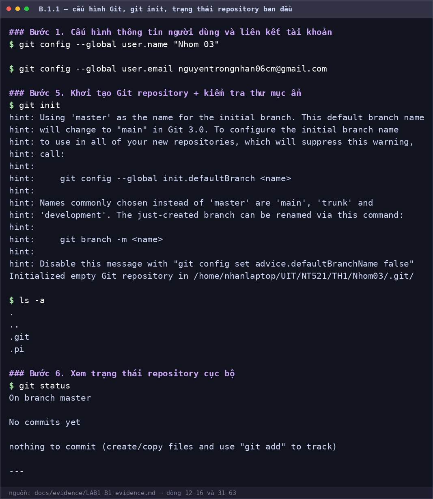

**Giải thích.**

- `git init` tạo thư mục ẩn **`.git/`** — nơi chứa toàn bộ lịch sử, đối tượng (object), tham chiếu (ref), cấu hình và reflog của repository. Đây là lý do Git không cần bất kỳ máy chủ nào vẫn quản lý được phiên bản.
- `git status` ngay sau khi init cho biết ba thông tin: **nhánh hiện tại là `master`**, **chưa có commit nào** (`No commits yet`), và **không có gì để commit** vì thư mục làm việc chưa có tập tin nào được theo dõi.
- Git 2.53 vẫn lấy `master` làm tên nhánh khởi tạo nhưng in kèm *hint* rằng Git 3.0 sẽ dùng `main`; muốn đổi mặc định thì đặt `git config --global init.defaultBranch <name>`.

### 1.2 B.1.2 — Staging và Committing một tập tin

```bash
$ cat > README.MD <<'EOF'
# Nhom03
Nguyen Trong Nhan - 24521236
Nguyen Trong Nhan - 24520023
Le Viet Hoang - 24520546
EOF
$ ls -la && cat README.MD
```

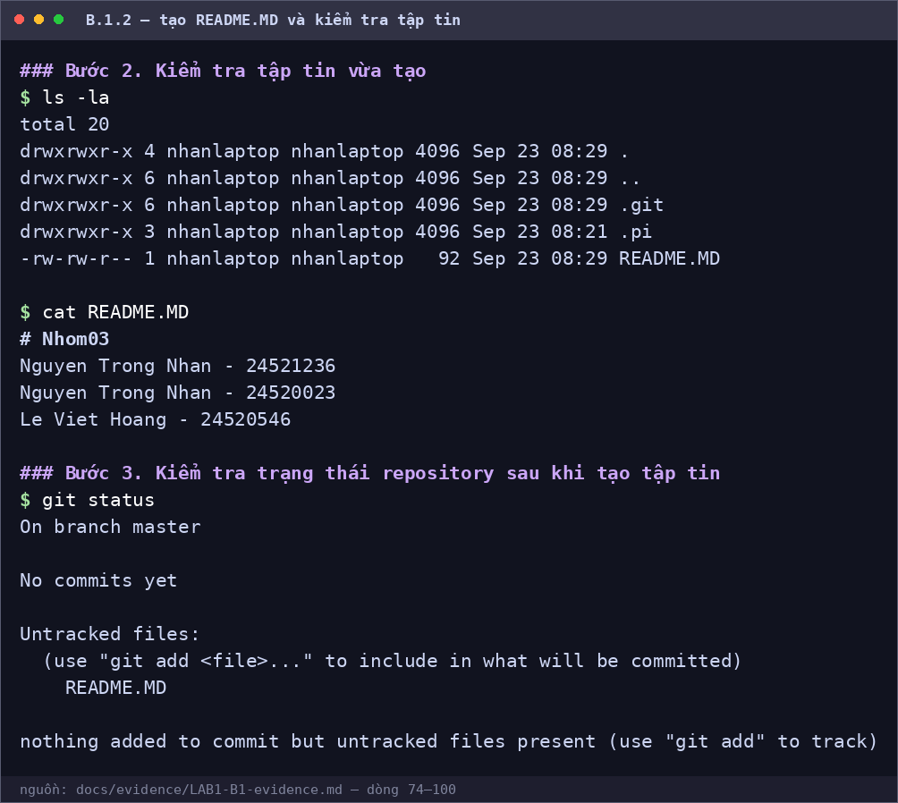

Ba trạng thái của Git được minh chứng bằng ba lần chạy `git status` liên tiếp:

| Thời điểm | `git status` báo | Vùng |
|---|---|---|
| Sau khi tạo tập tin | `Untracked files: README.MD` | working directory |
| Sau `git add README.MD` | `Changes to be committed → new file: README.MD` | **staging area (index)** — Git đã chụp *snapshot* của tập tin |
| Sau `git commit` | `nothing to commit, working tree clean` | repository (object database) |

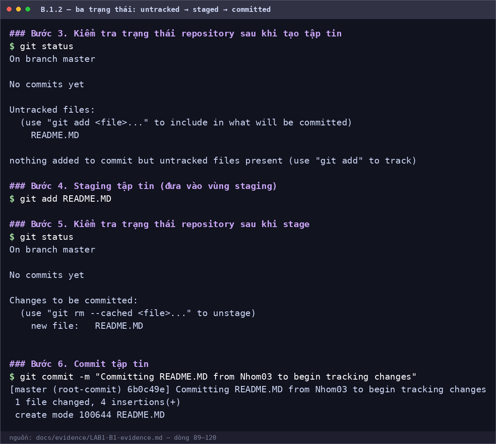

```bash
$ git commit -m "Committing README.MD from Nhom03 to begin tracking changes"
[master 6b0c49e] Committing README.MD from Nhom03 to begin tracking changes
 1 file changed, 4 insertions(+)
 create mode 100644 README.MD
```

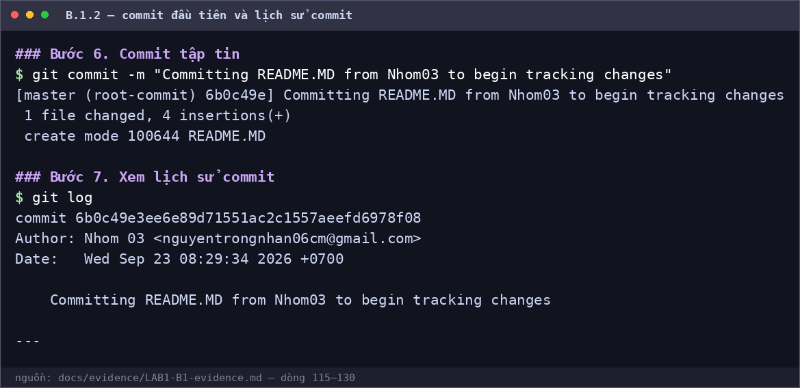

`6b0c49e` là **commit ID** — 7 ký tự đầu của giá trị băm SHA-1 đầy đủ (`6b0c49e3ee6e89d71551ac2c1557aeefd6978f08`). Mỗi commit được định danh bằng một hash duy nhất; tuỳ chọn `-m` cho phép gắn message giải thích thay đổi.

### 1.3 B.1.3 — Sửa đổi tập tin và theo dõi các thay đổi

```bash
$ echo "I am beginning to understand Git" >> README.MD   # ">>" nối thêm; ">" sẽ GHI ĐÈ toàn bộ nội dung cũ
$ git status        # -> "Changes not staged for commit: modified: README.MD"
$ git add README.MD
$ git commit -m "Nhom03 Added additional line to file"    # -> b889aa8, 1 file changed, 1 insertion(+)
```


```bash
$ git diff 6b0c49e3ee6e89d71551ac2c1557aeefd6978f08 HEAD
diff --git a/README.MD b/README.MD
index b32e865..0d2a1c2 100644
--- a/README.MD
+++ b/README.MD
@@ -2,3 +2,4 @@
 Nguyen Trong Nhan - 24521236
 Nguyen Trong Nhan - 24520023
 Le Viet Hoang - 24520546
+I am beginning to understand Git
```


**Ý nghĩa các ký hiệu trong output của `git diff`:**

| Ký hiệu | Ý nghĩa |
|---|---|
| `diff --git a/... b/...` | file được so sánh giữa hai commit; `a/` là bản ở commit đầu, `b/` là bản ở commit sau |
| `index b32e865..0d2a1c2 100644` | hash blob của nội dung cũ → mới; `100644` = file thường, không có quyền thực thi |
| `---` / `+++` | dòng đánh dấu bên cũ (`a/`) và bên mới (`b/`) |
| `@@ -2,3 +2,4 @@` | *hunk header*: từ dòng 2 của bản cũ lấy 3 dòng, tương ứng từ dòng 2 của bản mới lấy 4 dòng |
| ` ` (dòng có dấu cách đầu) | ngữ cảnh, không thay đổi |
| `-` | dòng bị **xoá** khỏi bản cũ |
| `+` | dòng được **thêm** vào bản mới |

`git log` cho biết mỗi commit gồm: **commit hash**, **Merge:** (chỉ có với merge commit), **Author**, **Date** và **message**.

### 1.4 B.1.4 — Branches và Merging

```bash
$ git branch feature      # tạo nhánh mới trỏ vào commit hiện tại
$ git branch              # master, KHÔNG có dấu * -> chưa checkout sang feature
$ git checkout feature
$ git branch              # -> * feature
```

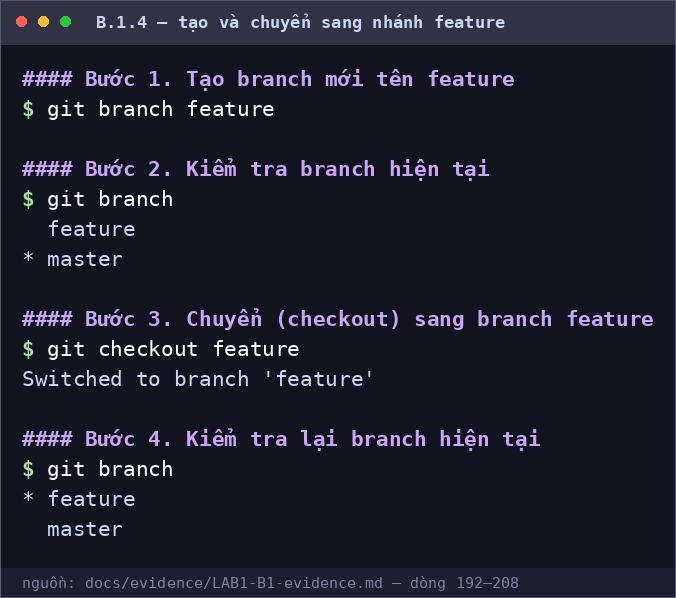

```bash
$ git checkout master
$ cat README.MD           # KHÔNG thấy dòng của feature -> thay đổi bị cô lập trong nhánh
$ git merge feature
Fast-forward
 README.MD | 1 +
$ git branch -d feature   # Deleted branch feature (was 6f0dc98).
```

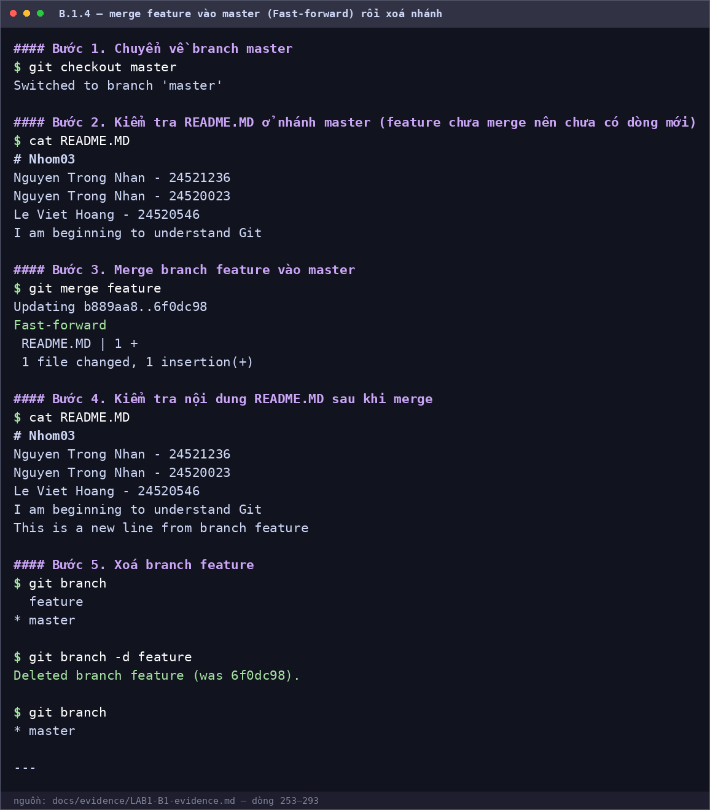

**Câu trả lời cho các điểm hỏi trong đề.**

- Dấu **`*`** trước tên nhánh trong `git branch` chính là nhánh đang được **checkout** (`HEAD` trỏ tới nó).
- Sau khi merge, nội dung `README.MD` trên `master` **bằng đúng** nội dung cuối của nhánh `feature` — không mất dòng nào, chỉ thêm dòng mới.
- Lần merge này là **`Fast-forward`**: vì `master` không có commit nào phát sinh kể từ lúc tách nhánh, Git chỉ cần **dời con trỏ `master`** tới commit của `feature`, do đó **không có merge commit** và lịch sử vẫn là một đường thẳng.
- Không thể xoá nhánh đang đứng trên đó, nên phải `git checkout master` trước khi `git branch -d feature`. `-d` chỉ xoá khi nhánh đã được merge (an toàn); `-D` xoá cưỡng bức.

### 1.5 B.1.5 — Xử lý xung đột khi merge

```bash
$ git branch test && git checkout test
$ sed -i 's/feature/test/' README.MD          # -> "... from branch test"
$ git commit -a -m "branch test Change feature to test"     # eda981f
$ git checkout master
$ sed -i 's/feature/master/' README.MD        # -> "... from branch master"
$ git commit -a -m "branch master Changed feature to master" # 62a858e
```

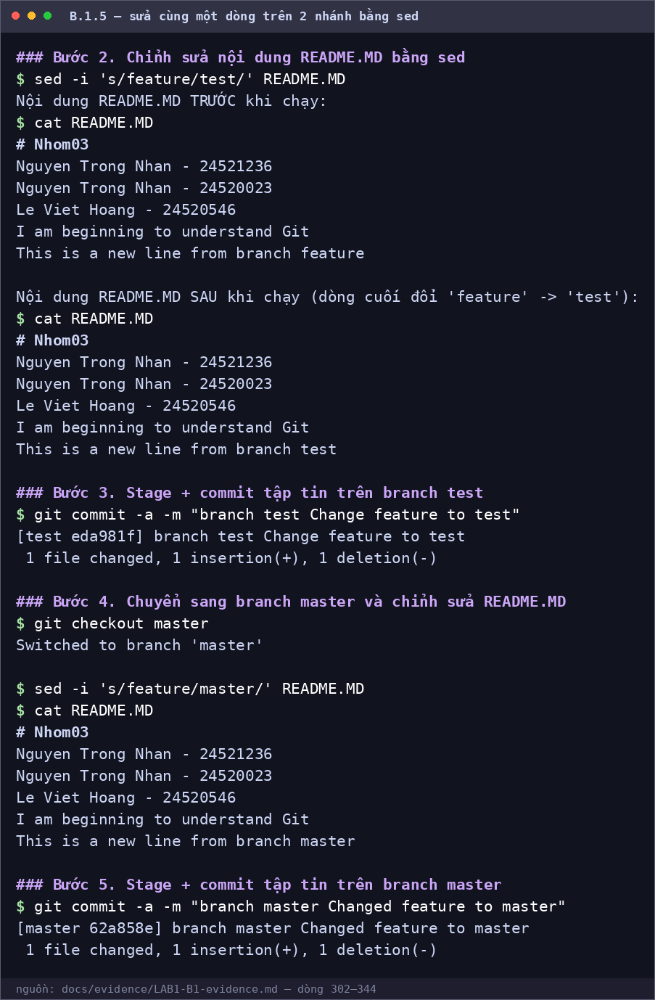

```bash
$ git merge test
Auto-merging README.MD
CONFLICT (content): Merge conflict in README.MD
Automatic merge failed; fix conflicts and then commit the result.
$ git status
On branch master
You have unmerged paths.
...
Unmerged paths:
        both modified:   README.MD
```

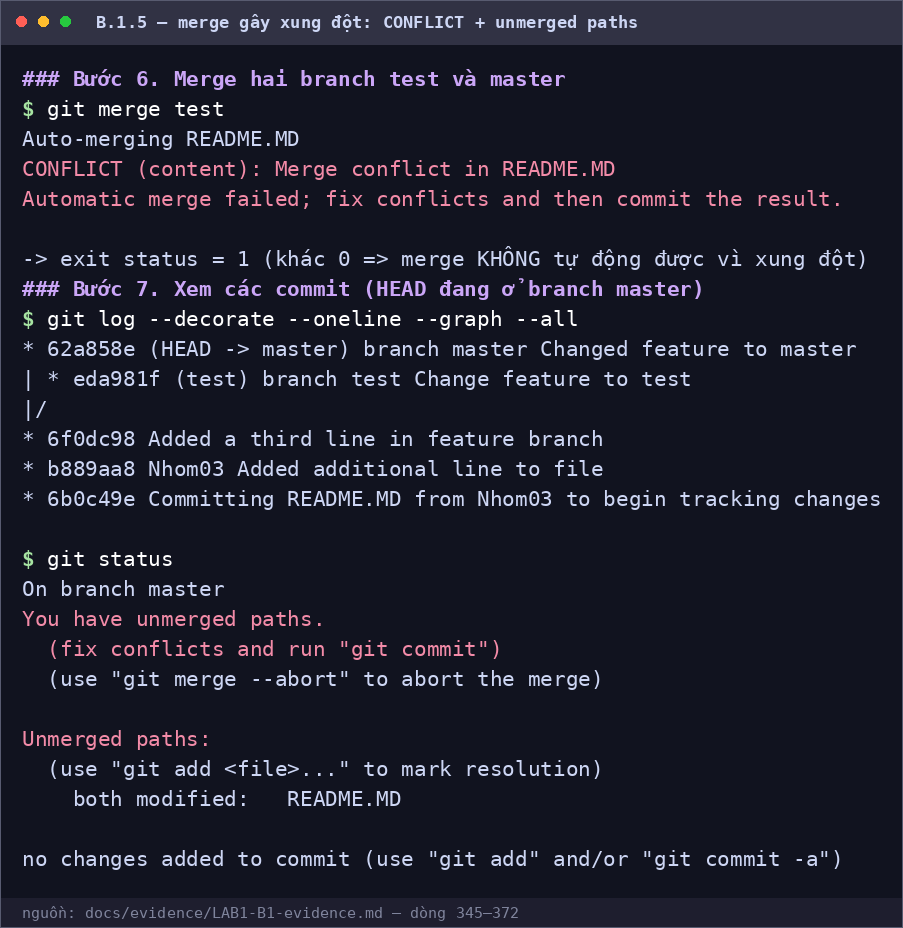

**Giải thích lệnh `sed -i 's/feature/test/' README.MD`:** `sed` biên tập luồng văn bản; `-i` (*in-place*) ghi thẳng kết quả ngược lại tập tin (không cần `> file`); biểu thức `s/<x>/<y>/` **thay thế lần xuất hiện đầu tiên** trên **mỗi dòng** (thêm `g` để thay tất cả, thêm `I` để không phân biệt hoa/thường). Tuỳ chọn `-a` của `git commit -a` tự động stage các tập tin **đã bị sửa hoặc xoá**, nhưng **không** bao gồm tập tin mới chưa từng được theo dõi.

**Vì sao xung đột?** Hai nhánh cùng sửa **đúng một dòng** (dòng cuối) xuất phát từ cùng một *merge base* là `6f0dc98`. Git tự hoà được những vùng sửa khác nhau, nhưng ở cùng một vị trí mà có hai phiên bản khác nhau thì không thể tự quyết định — nên nó đánh dấu và dừng lại.

**Đánh dấu xung đột trong tập tin:**

```
<<<<<<< HEAD                                      # phần của nhánh đang đứng (master)
This is a new line from branch master
=======                                           # vạch phân cách
This is a new line from branch test
>>>>>>> test                                      # phần của nhánh được merge
```

**Cách giải quyết:** mở `README.MD`, giữ lại một trong hai dòng, **xoá hết ba dòng marker**, sau đó `git add README.MD` để báo cho Git biết xung đột đã được giải quyết, rồi commit:

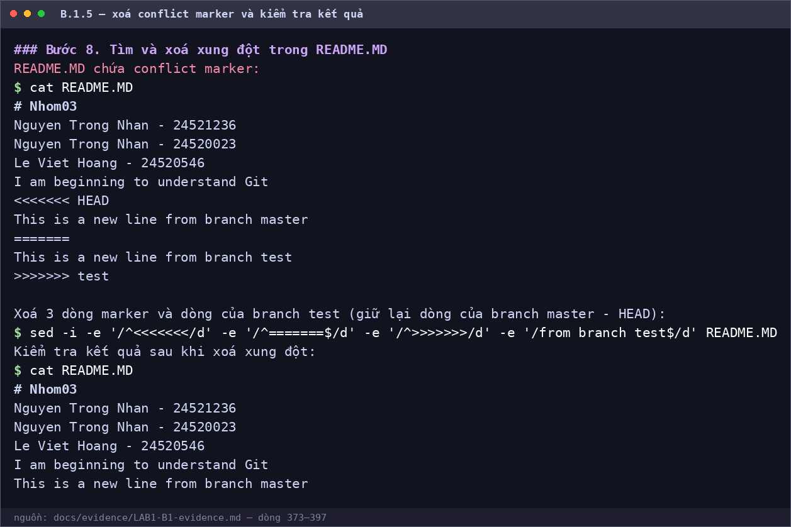

```bash
$ git add README.MD
$ git commit -a -m "Manually merged from test branch"
[master a6c11b2] Manually merged from test branch
$ git log -1
commit a6c11b2...
Merge: 62a858e eda981f      # <- merge commit có HAI cha
```

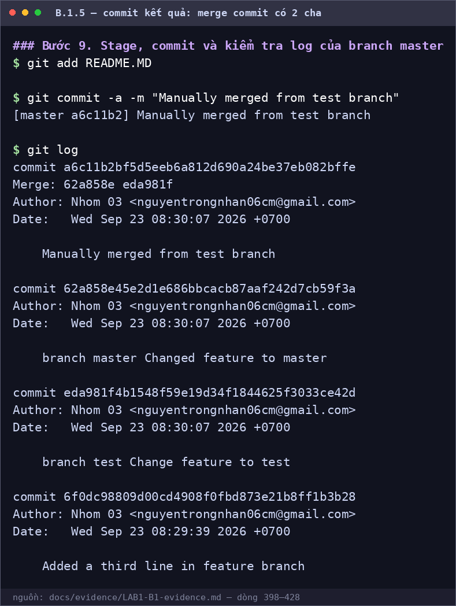

`git cat-file -p HEAD` xác nhận commit kết quả có hai dòng `parent` (`62a858e45e2d...` và `eda981f4b154...`) — dấu hiệu của một **merge commit thật sự**, khác với fast-forward ở B.1.4.

### 1.6 B.1.6 — Tích hợp Git với GitHub (Yêu cầu 2) — Cách A: GitHub CLI

GitHub **không còn cho push bằng mật khẩu tài khoản**, nên phải xác thực bằng token hoặc khoá SSH. Nhóm chọn **Cách A**:

```bash
$ gh auth login --hostname github.com --git-protocol https --web
! One-time code (F99F-1AF7) copied to clipboard
Open this URL to continue in your web browser: https://github.com/login/device
$ gh auth setup-git        # để Git tự dùng token của gh làm credential helper
$ gh auth status
github.com
  ✓ Logged in to github.com account Nhan-Laptop (keyring)
  - Git operations protocol: https
  - Token: gho_************************************
  - Token scopes: 'gist', 'read:org', 'repo', 'workflow'
```

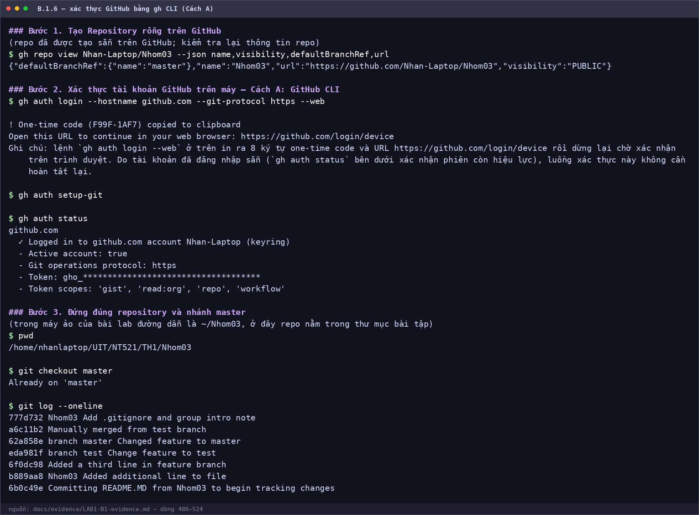

`gh auth setup-git` ghi vào `~/.gitconfig` hai dòng `credential.https://github.com.helper = !/usr/bin/gh auth git-credential`, nhờ đó Git hỏi token qua `gh` (token lưu trong keyring của hệ điều hành, không nằm trong `.git/config`).

```bash
$ cd ~/Nhom03 && git checkout master && git log --oneline
$ git remote add origin https://github.com/Nhan-Laptop/Nhom03.git
$ git remote -v
origin  https://github.com/Nhan-Laptop/Nhom03.git (fetch)
origin  https://github.com/Nhan-Laptop/Nhom03.git (push)
$ git push -u origin master --force
```

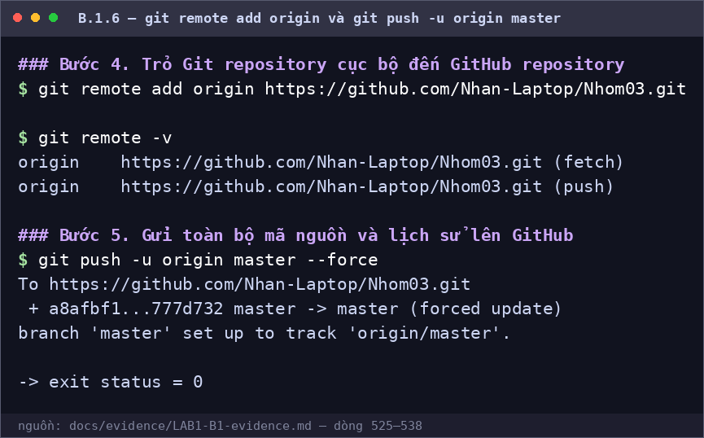

Lệnh push cần `--force` vì lịch sử cục bộ đã được **khởi tạo lại từ đầu** (reset sạch để báo cáo đúng trình tự từng bước của đề), nên hai phía không còn chung tổ tiên. Branch `master` trên GitHub được thay bằng chuỗi commit của nhóm.

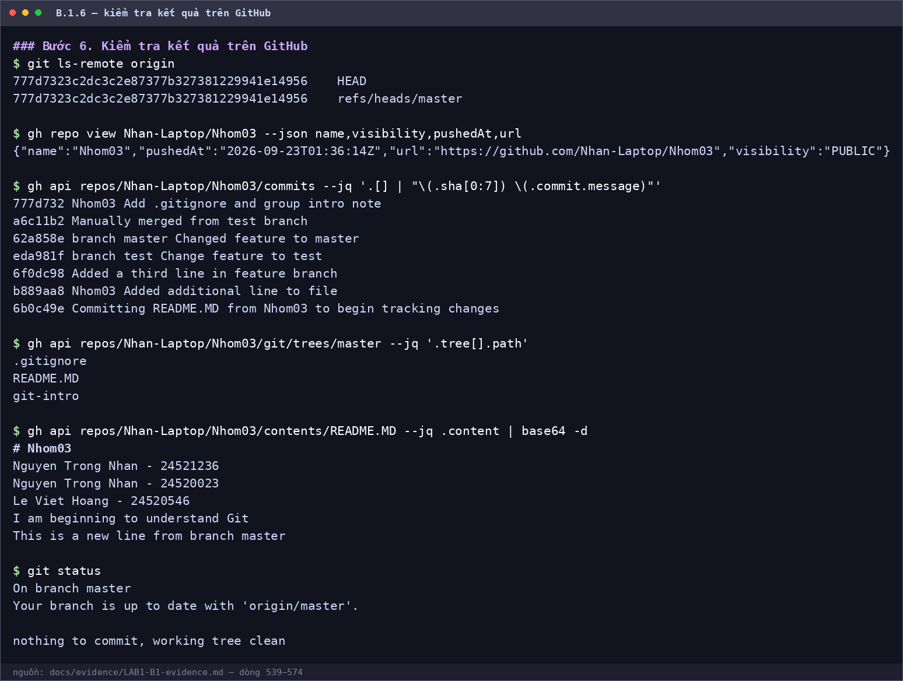

### 1.7 Lịch sử commit của phần B.1

| Commit | Nhánh | Message | Thuộc bước |
|---|---|---|---|
| `6b0c49e` | master | Committing README.MD from Nhom03 to begin tracking changes | B.1.2 |
| `b889aa8` | master | Nhom03 Added additional line to file | B.1.3 |
| `6f0dc98` | feature → master | Added a third line in feature branch | B.1.4 (fast-forward) |
| `eda981f` | test | branch test Change feature to test | B.1.5 |
| `62a858e` | master | branch master Changed feature to master | B.1.5 |
| `a6c11b2` | master | Manually merged from test branch (**merge commit, 2 cha**) | B.1.5 |
| `777d732` | master | Nhom03 Add .gitignore and group intro note | B.1.6 |

---

## 2. Phần B.2 — Vòng SSDLC thu nhỏ trên chức năng `json_search()`

### 2.1 Chuẩn bị

```bash
$ tar -xzf ../unittest.tar.gz          # recursive_json_search.py, test_data.py, test_json_search.py, policy.py
$ git add unittest/ && git commit -m "Nhom03 Add baseline unittest resources for B2"   # 026c591 (master)
```

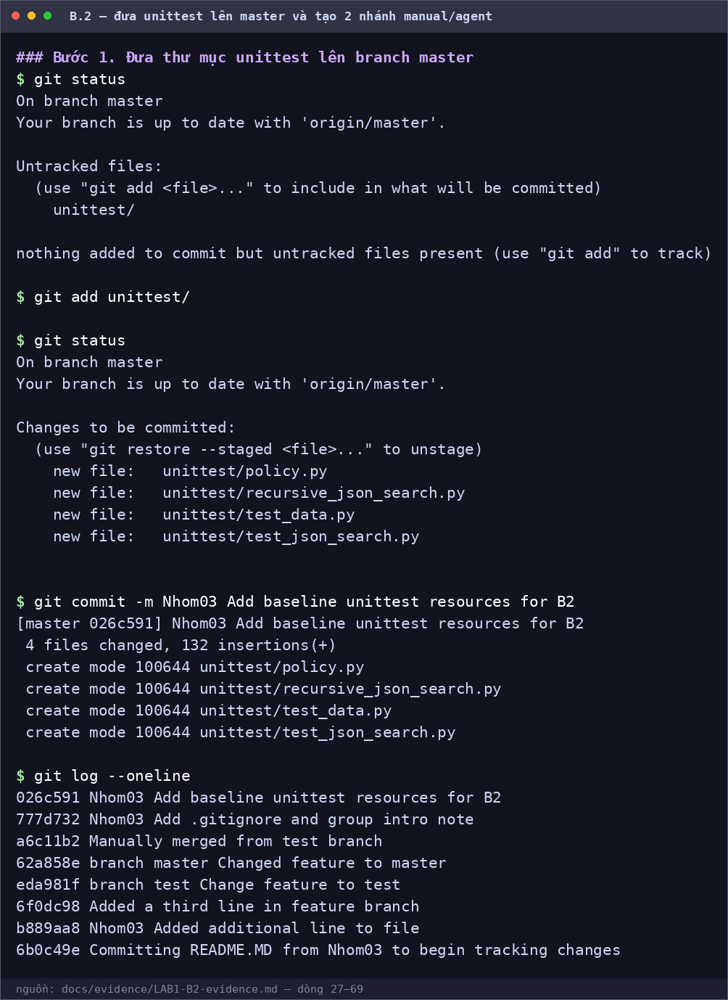

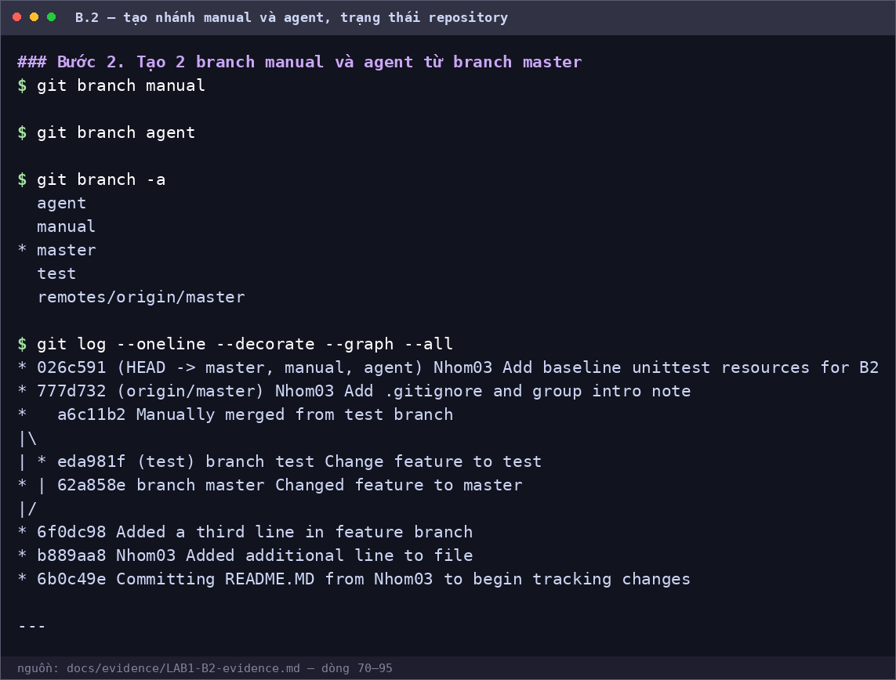

| Nhánh | Số commit riêng | Kết quả kiểm thử |
|---|---|---|
| `master` | baseline (file mã còn trống) | 0 test |
| `manual` | 3 | **11 test — OK** |
| `agent` | 3 | **24 test — OK** |

### 2.2 B.2.1 — Phát triển thủ công (nhánh `manual`)

#### 2.2.1 Yêu cầu 3 — Security Requirements và Threat Model

Toàn bộ phân tích nằm trong **[`unittest/security-requirements.md`](https://github.com/Nhan-Laptop/Nhom03/blob/master/unittest/security-requirements.md)** (commit `cbde878` trên nhánh `manual`, nay có cả trên `master`). Tóm tắt đủ bốn ý (a)–(d) mà đề yêu cầu:

**(a) Actor / role được phép gọi hàm và mục đích**

| Role | Mục đích gọi `json_search()` | Được đọc |
|---|---|---|
| `viewer` | theo dõi tình trạng sự cố (read-only) | `issueSummary` |
| `operator` | xử lý sự cố, cần địa chỉ quản trị thiết bị | `issueSummary`, `managementIpAddress` |
| `admin` | tái cấu hình thiết bị, cần thông tin xác thực | cả ba trường |
| `role=None` | không có phiên hợp lệ | **không được đọc trường nào trong `POLICY`** |

Quyền hạn lấy từ bảng `POLICY` trong `policy.py` (allowlist theo từng trường).

**(b) Asset nhạy cảm có thể xuất hiện trong dữ liệu trả về**

- `apiKey` = `SNMP-COMMUNITY-STRING-7f3a9c` — **chuỗi community SNMP**, tức thông tin xác thực để quản trị thiết bị mạng; lộ nó là lộ khả năng đọc/ghi cấu hình thiết bị.
- `managementIpAddress` = `10.10.20.21` (kèm `actualServiceId` = `10.10.20.82`) — địa chỉ quản trị, phục vụ trinh sát và tấn công trực tiếp.
- Thông tin định danh thiết bị: `serialNumber`, `macAddress`, `instanceUuid`, `hostname`, `platformId`.
- Thông tin vận hành nội bộ: `issueSummary`, `issueDescription`, `impactedHosts.location` (lộ topology và mức ảnh hưởng).

**(c) Trust boundary đang bị bỏ qua**

Ranh giới quyết định là **caller → `json_search()`**. Bản gốc **không hề biết caller là ai**: nó trả mọi giá trị tìm được cho bất kỳ lời gọi nào. Xác thực/phân quyền ở tầng trên (web API, CLI) **không thay thế được** việc kiểm tra ngay trong hàm, vì `json_search()` là điểm vào dùng chung của thư viện và có thể bị gọi trực tiếp từ module khác, từ REPL hay từ chính bộ test.

**(d) Threat ánh xạ vào Information Disclosure / Elevation of Privilege (STRIDE)**

| # | Nhóm STRIDE | Threat | Biện pháp giảm thiểu |
|---|---|---|---|
| T1 | **Information Disclosure** | `viewer` gọi `json_search("apiKey", data)` và nhận về community string | allowlist theo `POLICY` trước khi thêm kết quả |
| T2 | **Information Disclosure** | caller **bỏ luôn tham số `role`** để bypass kiểm soát truy cập | **fail-closed**: `role=None`/role lạ không đọc được trường được bảo vệ |
| T3 | **Elevation of Privilege** | `operator`/`viewer` tự khai `role="admin"` và được tin (client-side trust) | `role` phải do tầng xác thực server-side cấp; test từ chối role lạ |
| T4 | **Information Disclosure** | `viewer` không hỏi `apiKey` mà hỏi **key cha** `deviceDetails` để lấy nguyên cây con chứa secret | **lọc đệ quy (`_filter_value`)** mọi trường bị hạn chế ở mọi độ sâu |
| T5 | Tampering / DoS | JSON dị dạng hoặc lồng quá sâu làm hàm crash/treo | luôn trả `list`, không crash; giới hạn độ sâu là khuyến nghị mở rộng |
| T6 | Repudiation | không có vết kiểm toán khi bị từ chối | ghi log sự kiện từ chối (ngoài phạm vi lab) |

**Security requirements rút ra (SR-1 … SR-5)**, mỗi SR được ánh xạ 1–1 tới test:

| ID | Phát biểu | Threat | Test chứng minh |
|---|---|---|---|
| SR-1 | Hệ thống **chỉ trả về** giá trị của trường X nếu `role` nằm trong danh sách được phép đọc X | T1, T3 | `test_wrong_role_cannot_read_secret`, `test_operator_cannot_read_api_key`, `test_admin_can_read_api_key`, `test_viewer_can_read_issue_summary`, `test_management_ip_requires_operator_or_admin` |
| SR-2 | **Fail-closed:** không cung cấp `role` thì không được đọc trường nào trong `POLICY` | T2 | `test_no_role_cannot_read_secret` |
| SR-3 | Kết quả **không chứa** trường bị hạn chế ở **bất kỳ độ sâu nào**, kể cả khi truy vấn bằng key cha | T4 | `test_parent_key_does_not_leak_secret` |
| SR-4 | Không crash, luôn trả về `list` | T5 | `test_search_not_found`, `test_is_a_list` |
| SR-5 | Tìm kiếm đệ quy phải **gộp kết quả ở mọi cấp** (đúng chức năng) | — | `test_search_found`, `test_nested_matches_are_aggregated` |

#### 2.2.2 Bước 2–3 — Cài đặt và chạy bản gốc

Bản mã trong đề được gõ lại nguyên trạng vào `recursive_json_search.py`, chạy:

```bash
$ python3 recursive_json_search.py
[]
```

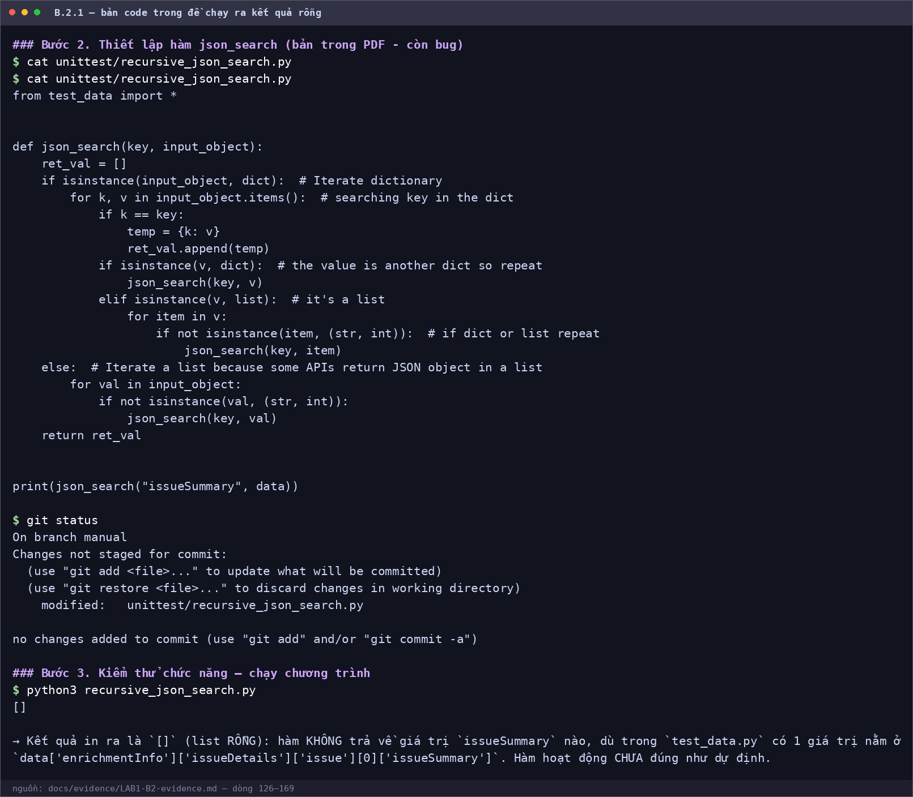

Kết quả **rỗng**, tức hàm **không** trả về giá trị `issueSummary` nào, mặc dù `test_data.py` có một giá trị tại
`data["enrichmentInfo"]["issueDetails"]["issue"][0]["issueSummary"]` ⇒ hàm hoạt động **không đúng như dự định**.

#### 2.2.3 Bước 4 — Unit test

```bash
$ python3 -m unittest -v test_json_search.py
test_search_found (...)  key should be found, return list should not be empty ... FAIL
test_search_not_found (...)  key should not be found, should return an empty list ... ok
test_is_a_list (...)  Should return a list ... ok
Ran 3 tests in 0.002s
FAILED (failures=1)
```

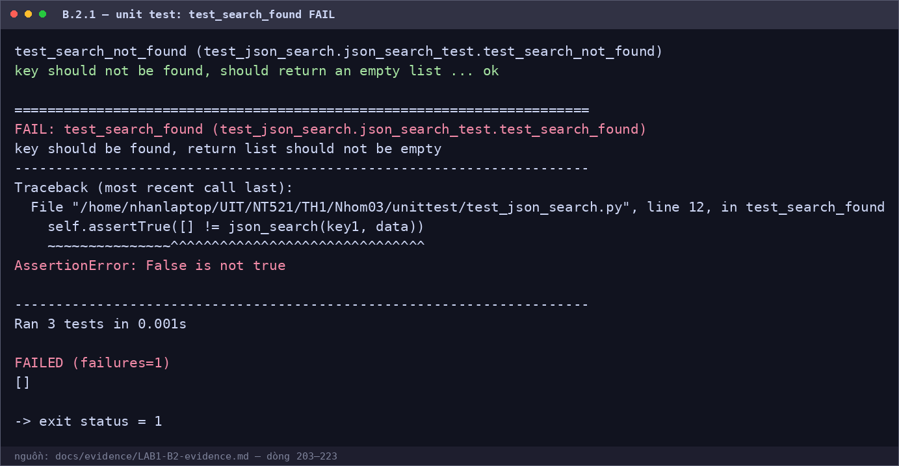

#### 2.2.4 Yêu cầu 4 — Nguyên nhân lỗi và bản vá

| Test | Kết quả | Lý do |
|---|---|---|
| `test_search_found` | **FAIL** | `issueSummary` nằm ở các **nhánh con**; kết quả tìm được ở nhánh con bị bỏ ⇒ lần gọi gốc trả `[]` |
| `test_search_not_found` | PASS (giả) | `key2` không tồn tại nên `[] == []` vẫn đúng **kể cả khi hàm sai** |
| `test_is_a_list` | PASS (giả) | kiểu trả về vẫn là `list` |

**Nguyên nhân gốc:** `ret_val = []` được **khởi tạo lại ở mỗi lần gọi đệ quy**, và giá trị trả về của lần gọi con **không được nhận lại** — `json_search(key, v)` được gọi rồi bỏ kết quả. Chỉ những khớp ở *cùng cấp* với lần gọi hiện tại mới được giữ.

**Bản vá (3 dòng, chỉ thêm `ret_val +=`):**

```diff
-                json_search(key, v)
+                ret_val += json_search(key, v)
...
-                        json_search(key, item)
+                        ret_val += json_search(key, item)
...
-                json_search(key, val)
+                ret_val += json_search(key, val)
```

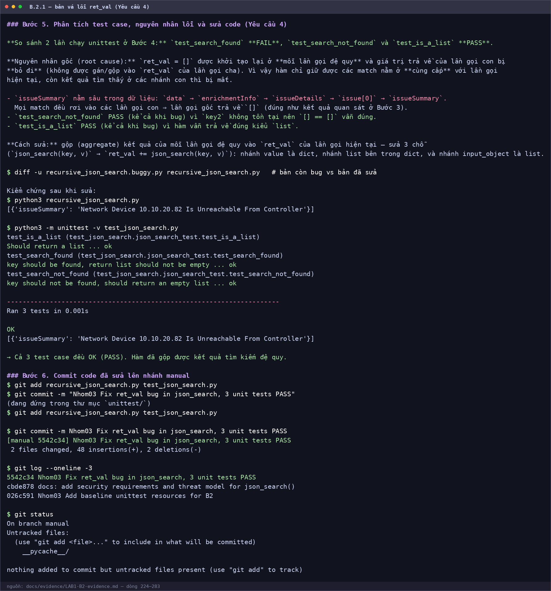

```bash
$ python3 recursive_json_search.py
[{'issueSummary': 'Network Device 10.10.20.82 Is Unreachable From Controller'}]
$ python3 -m unittest -v test_json_search.py
Ran 3 tests in 0.001s
OK
```

Commit `5542c34` trên nhánh `manual`.

#### 2.2.5 Yêu cầu 5 — Kiểm soát truy cập theo role và security test

Hàm được đổi chữ ký thành `json_search(key, input_object, role=None)`; `POLICY` trong `policy.py` trở thành nguồn chân lý duy nhất cho quyết định truy cập, kèm ba lớp:

```python
def _is_allowed(key, role):          # SR-1/SR-2: chỉ cho khi role nằm trong POLICY[key]
    if key not in POLICY:
        return True                  # trường không bị hạn chế
    return role in POLICY[key]

def _filter_value(value, role):      # SR-3: lọc đệ quy cây con, chặn bypass qua key cha
    if isinstance(value, dict):
        return {k: _filter_value(v, role) for k, v in value.items() if _is_allowed(k, role)}
    if isinstance(value, list):
        return [_filter_value(item, role) for item in value]
    return value
```

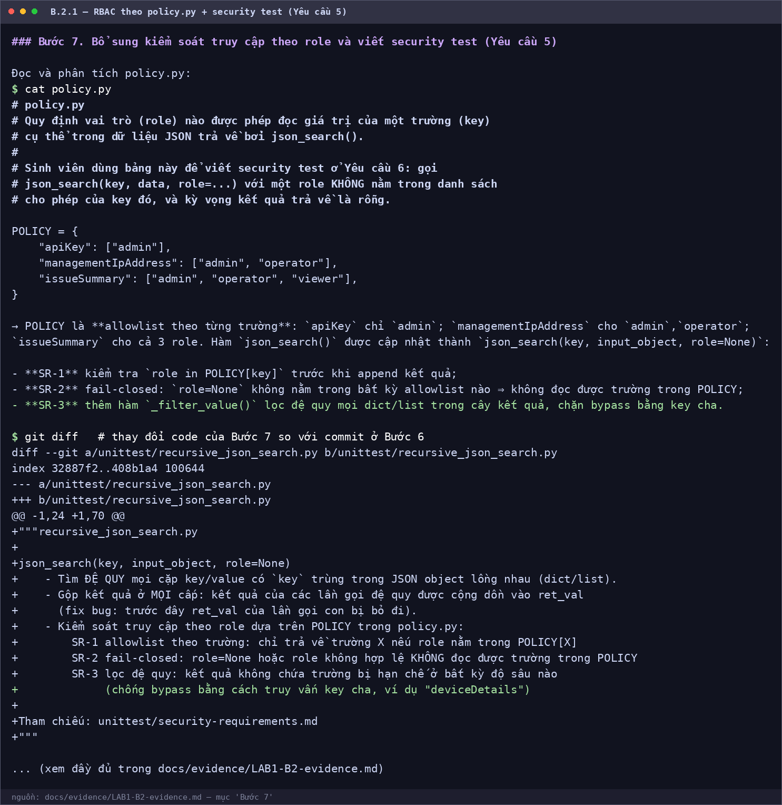

Kết quả kiểm chứng bằng tay (đủ ba chiều: chặn sai, cho đúng, không chặn nhầm):

```
admin  + apiKey        -> [{'apiKey': 'SNMP-COMMUNITY-STRING-7f3a9c'}]
operator + apiKey      -> []
viewer + apiKey        -> []
role=None + apiKey     -> []
viewer + issueSummary  -> [{'issueSummary': 'Network Device 10.10.20.82 Is Unreachable From Controller'}]
viewer + deviceDetails -> cây con ĐÃ được loại bỏ apiKey và managementIpAddress
```

Bộ test trên nhánh `manual` gồm **11 test** (4 chức năng + 7 security, mỗi method có docstring):

```bash
$ python3 -m unittest -v test_json_search.py
Ran 11 tests in 0.000s
OK
```

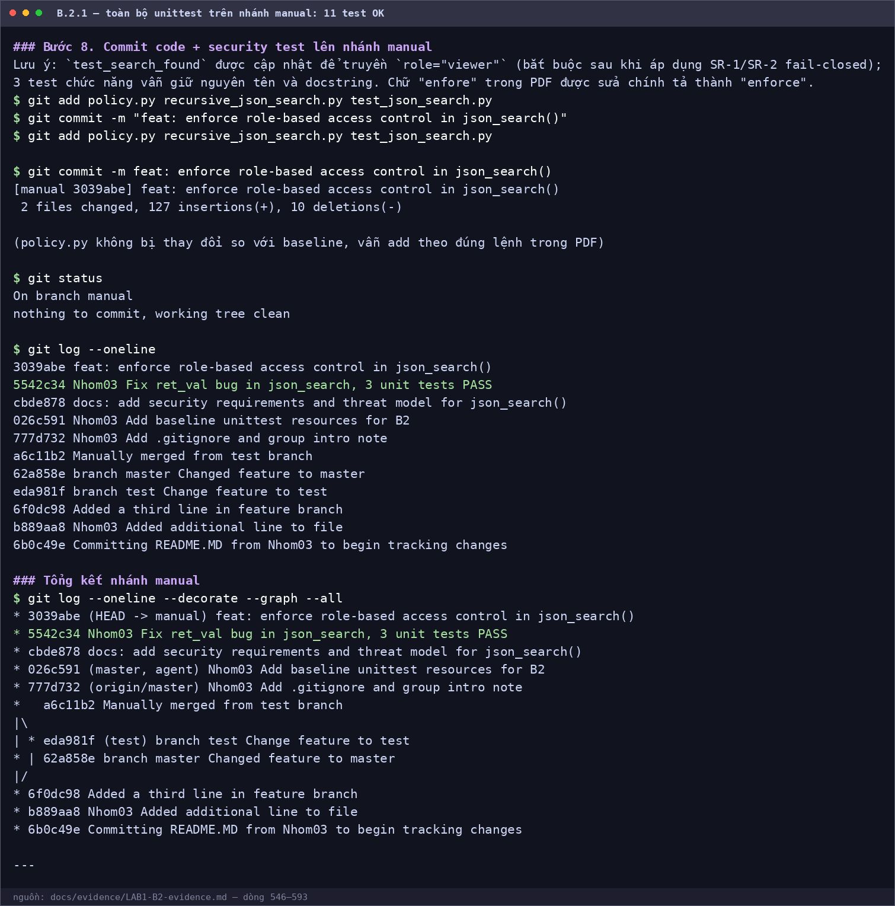

Commit `3039abe`. *Lưu ý:* `test_search_found` phải truyền `role="viewer"` vì `issueSummary` đã nằm trong `POLICY` — thay đổi duy nhất ở bộ test chức năng, được ghi chú rõ trong commit.

### 2.3 B.2.2 — AI coding agent (nhánh `agent`, Yêu cầu 6)

**Cách vận hành.** Đặc tả an toàn ở mục 2.2.1 được đưa sang nhánh `agent` (`41bdbf9`). Agent được chạy **tách biệt** khỏi phiên của người kiểm duyệt:

| Yếu tố | Cấu hình |
|---|---|
| Công cụ / model | Pi coding agent, `opencode-go/deepseek-v4-flash-vision-exp` (vòng 2 tự failover sang `qwen3.8-flash`) |
| Chế độ chạy | non-interactive, xuất luồng sự kiện có cấu trúc (`--mode json -p`), `--no-approve` (môi trường kín, không nạp cấu hình dự án) |
| “Ask for approval” | cài `.git/hooks/pre-commit` **chặn cứng** mọi `git commit` trong lúc agent chạy ⇒ agent chỉ ghi đề xuất; người kiểm duyệt tự chạy test, đọc diff rồi mới commit |
| Kiểm tra vi phạm sandbox | `git reflog` sau mỗi vòng: không có commit/checkout lạ; `git status`: chỉ 2 file mã được sửa + `AGENT-LOG.md` mới, không chạm `policy.py`/`test_data.py` |
| Prompt | [`docs/evidence/agent/prompt.txt`](docs/evidence/agent/prompt.txt) (nguyên văn) |
| Agent log | [`unittest/AGENT-LOG.md`](https://github.com/Nhan-Laptop/Nhom03/blob/agent/unittest/AGENT-LOG.md) (`9d66705`) + telemetry thô `docs/evidence/agent/events*.jsonl` |

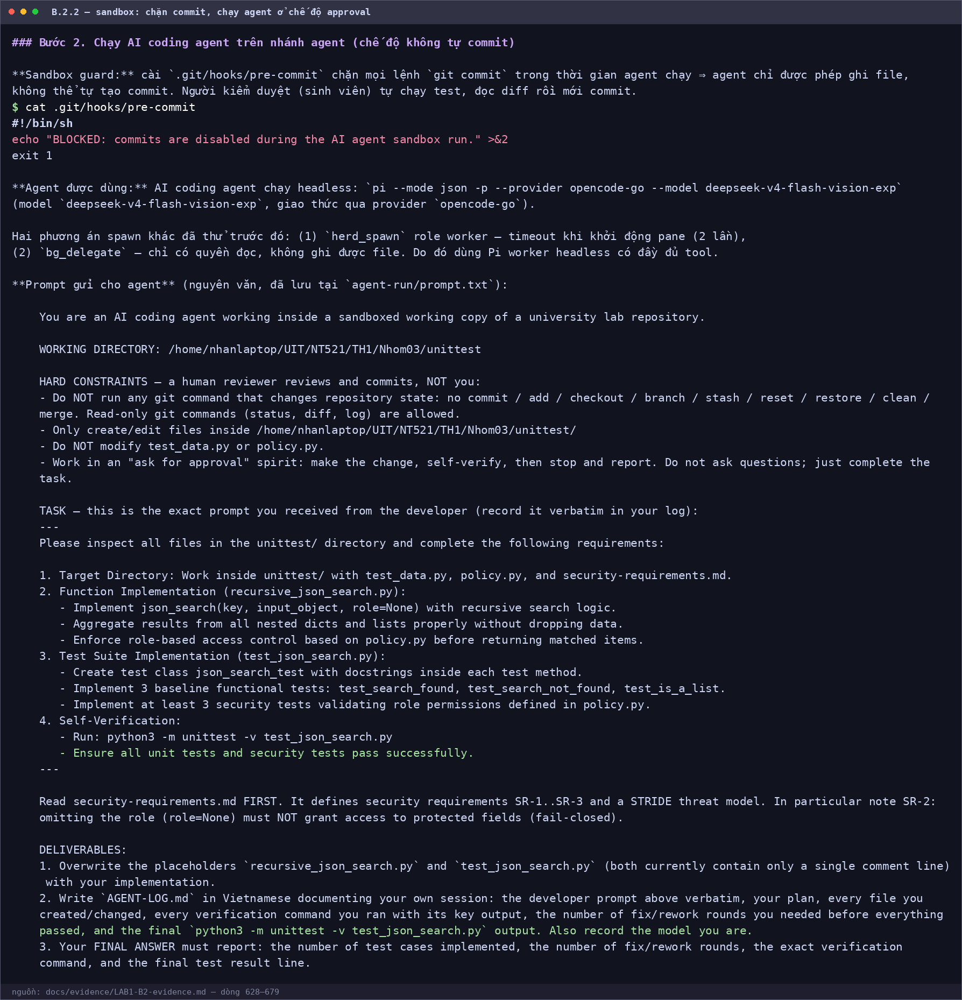

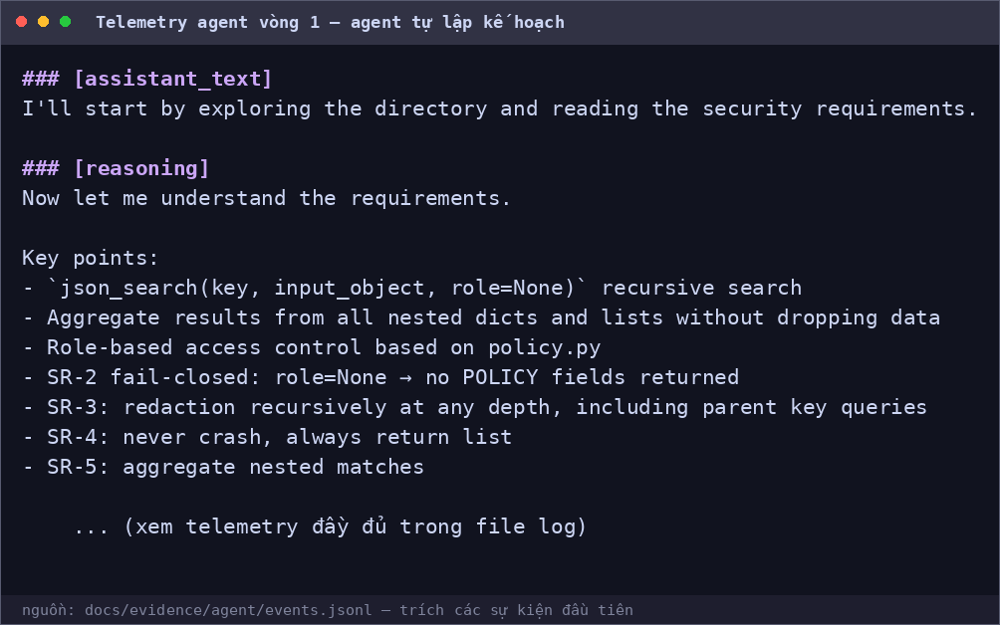

**Điểm quan trọng:** telemetry ở Hình 26 cho thấy agent **thực sự đọc `security-requirements.md`** và biến các security requirement thành kế hoạch làm việc — tức chất lượng đầu ra của agent phụ thuộc trực tiếp vào đặc tả do con người viết ở Bước 1.

**Các chế độ vận hành của agent và sự khác nhau (câu hỏi trong đề):**

| Nhóm | Chế độ | Cơ chế | Dùng ở đây? |
|---|---|---|---|
| Tương tác | TUI mặc định | hiển thị từng bước, người dùng duyệt ngay trong phiên | ✗ |
| | `--print` (`--mode text`) | một-shot, in trả lời cuối rồi thoát | ✗ |
| | `--mode json` | một-shot nhưng **phát sự kiện có cấu trúc** (nội dung, reasoning, tool call, token/chi phí) → chạy nền + kiểm toán được | **✓ cả 2 vòng** |
| | `--mode rpc` | agent chạy như service, IDE/host điều khiển | ✗ |
| Phê duyệt | Ask-for-approval | agent đề xuất, người duyệt rồi áp dụng/commit | **✓** (hook + review) |
| | `--approve` / `--no-approve` | tin hay bỏ qua cấu hình/extension/prompt nằm trong dự án | **✓ `--no-approve`** |
| | auto-edit / full-auto | agent tự ghi file, tự commit | ✗ |
| Phạm vi tool | `--tools` / `--exclude-tools` / `--no-tools` | allowlist/denylist công cụ ⇒ chuyển agent sang chế độ chỉ đọc (chỉ tư vấn) hoặc không được chạy lệnh | ✗ |
| Phiên | lưu session (mặc định), `--continue`, `--session <id>`, `--fork` | agent **nhớ ngữ cảnh** giữa các vòng | **✓** vòng 2 dùng `--session` |
| | `--no-session` | phiên tạm, không lưu lịch sử | ✗ |

Điểm khác biệt cốt lõi: **ai là người duyệt** (duyệt ngay trong TUI so với duyệt sau khi chạy xong nhờ hook + review), **agent có quyền ghi file hay không** (phạm vi tool), và **agent có giữ ngữ cảnh giữa các vòng hay không** (chế độ phiên).

**Diễn biến hai vòng.**

| Vòng | Thời lượng | Tool call | Kết quả |
|---|---|---|---|
| 1 | 3′34″ | 34 (0 lỗi) | 22 test; **1 lần tự chạy đỏ** do chính kỳ vọng test sai (fixture có 4 khớp `message`, test chỉ mong 3) → agent tự sửa → `Ran 22 tests / OK` |
| review | ~10′ | — | người kiểm duyệt phát hiện **lỗi vi phạm hợp đồng trả về**: `json_search("apiKey", data, role="admin")` trả `['SNMP-...']` thay vì `[{'apiKey': 'SNMP-...'}]`; test của agent **assert theo đúng cái sai** nên vẫn xanh ⇒ chặn merge |
| 2 | 10′09″ | 28 (1 lỗi) | sửa 1 dòng `results.append({field: _redact(value, role)})`, viết lại toàn bộ assertion qua helper `assertKeyValuePairs` (buộc mỗi khớp là dict **đúng 1 entry**, key **đúng bằng** key cần tìm), thêm 2 test khoá hợp đồng → `Ran 24 tests / OK` |

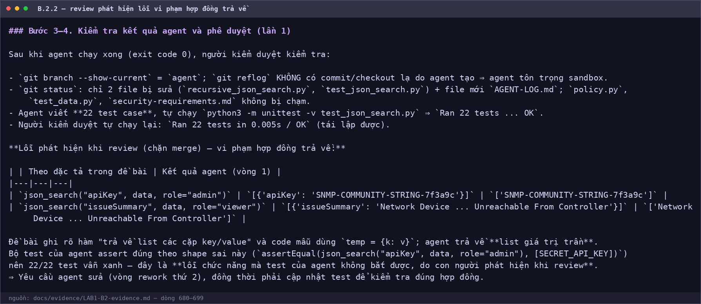

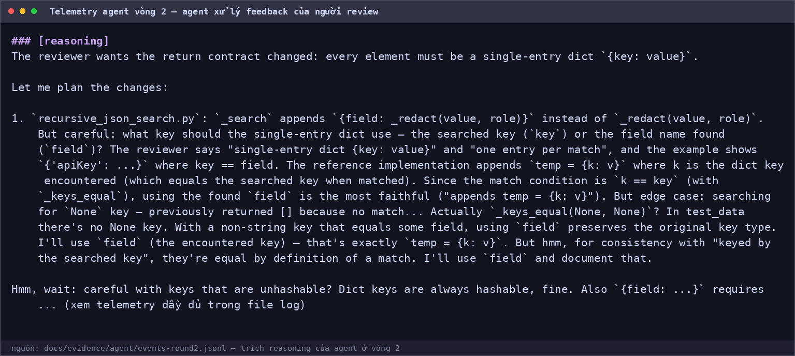

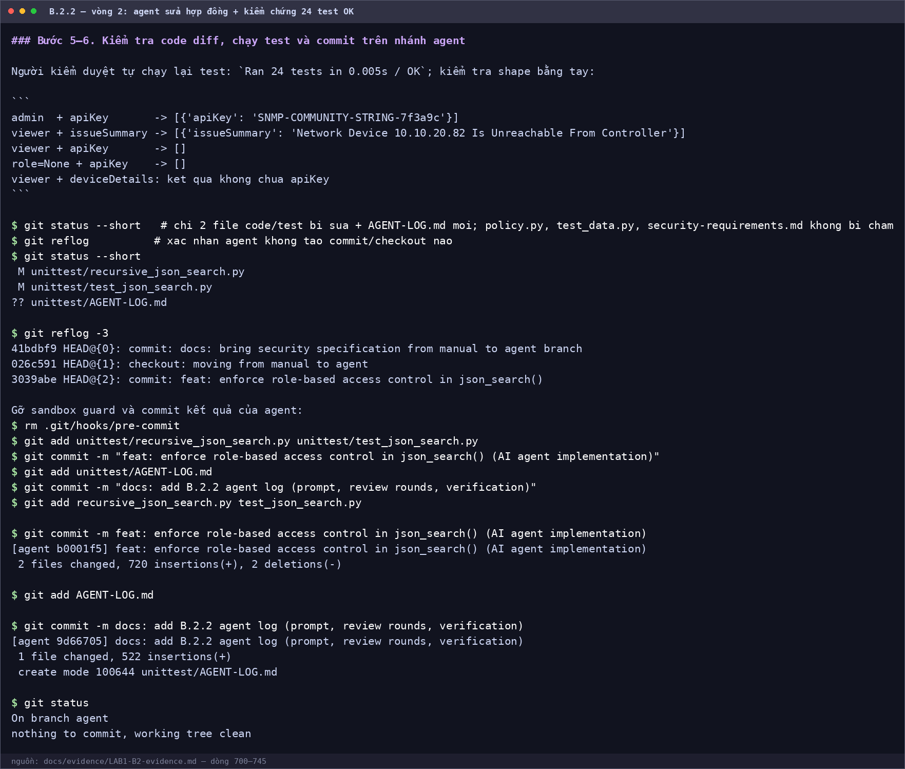

**Kết luận về chất lượng đầu ra của agent:** đạt (và **vượt**) `manual` về độ phủ an toàn — fail-closed triệt để hơn (role lạ/`None`/không phải chuỗi ⇒ không đọc được **bất kỳ** trường nào), không đi vào cây con bị hạn chế, `_redact` trả **bản sao sâu** nên không làm hỏng dữ liệu nguồn, bắt `RecursionError` và so khoá an toàn trước dữ liệu thù địch — nhưng **im lặng thay đổi hợp đồng hàm** so với đặc tả, thứ mà test tự sinh không thể phát hiện.

### 2.4 Bước 7 — Đối sánh hai quy trình

| Tiêu chí | Thủ công (`manual`) | AI Agent (`agent`) |
|---|---|---|
| **Mức đáp ứng security requirement** | SR-1 ✅, SR-2 ✅ (chỉ trong `POLICY`), SR-3 ✅, SR-4 ✅ (không crash), SR-5 ✅. Điểm yếu: `role=None` vẫn đọc được trường **ngoài** `POLICY` | SR-1 ✅, SR-2 ✅ **triệt để** (mọi trường khi role không hợp lệ), SR-3 ✅ + không duyệt cây con bị hạn chế + không mutate input, SR-4 ✅ (bắt `RecursionError`, chống `__eq__` độc), SR-5 ✅ (giữ cả khớp “falsy” như `[]`) → **đáp ứng đầy đủ hơn** |
| **Số lỗi chức năng phát hiện được / còn sót** | Phát hiện **1** (bug `ret_val`) do test ở Bước 4 bắt được; còn sót **0** | Vòng 1 tự phát hiện **1** lỗi kỳ vọng test; người review phát hiện **1** lỗi hợp đồng trả về mà **22/22 test không bắt được**; còn sót **0** sau vòng 2 |
| **Số lỗi an toàn phát hiện được / còn sót** | Phát hiện **1** (T4: hỏi key cha để lấy secret) ngay ở pha threat model và chặn từ thiết kế; còn sót **1 điểm yếu mức thiết kế** (`role=None` đọc trường ngoài `POLICY`, đã ghi ở mục 7 của tài liệu đặc tả) | **0** lỗ hổng bị phát hiện khi đối chiếu từng SR; nhưng có **1 rủi ro quy trình**: đặc tả và test do cùng một agent sinh ra có thể tự khẳng định lẫn nhau (self-consistency), cần test hợp đồng độc lập |
| **Thời gian thực hiện (ước lượng)** | ≈ **2′31″** wall-clock cho phần code/test, nhưng người phải có mặt ở từng bước; nếu người tự làm hết (đọc đề, viết threat model, code, test) ước lượng **2–4 giờ** | ≈ **13′43″** cho cả 2 vòng, **chạy nền không cần người**, chi phí ≈ **0,115 USD**; cộng ~10 phút review của người |
| **Mức độ can thiệp của con người** | Can thiệp ở **mọi** bước; 3 commit do người tạo; 1 lần sửa tay khi thêm RBAC (`test_search_found` phải truyền `role`) | Can thiệp **2 lần**: gửi review chặn merge + yêu cầu làm lại; duyệt diff và commit. Phải giám sát thêm: model bị đổi giữa hai vòng (failover) |
| **Khả năng tái lập** | **Cao** — mọi bước là lệnh tất định, đặc tả nằm trong file, test deterministic ⇒ chạy lại cho kết quả giống hệt (`Ran 11 tests / OK`) | **Thấp hơn** — cùng prompt cho code/test khác nhau giữa các lần (LLM không tất định) và đã đổi model giữa vòng 1 và vòng 2. Phần **kiểm chứng** vẫn tái lập được: prompt + session + telemetry được lưu, test deterministic (`Ran 24 tests / OK`) |

**Kết luận.**

1. **Agent vượt trội về độ phủ và tốc độ:** 24 test so với 11, xử lý thêm nhiều ca biên (dữ liệu vòng, `RecursionError`, role không phải chuỗi, khớp rỗng, không mutate input, không duyệt cây con bị hạn chế) trong ~14 phút với ~0,12 USD.
2. **“Test xanh” của agent không phải bằng chứng “đúng đặc tả”.** Agent tự đổi hợp đồng trả về rồi viết test khớp với cái sai của mình — chỉ người đọc kỹ đặc tả mới bắt được. Cổng review của con người vì vậy **không thể bỏ qua**, và nên có **test hợp đồng độc lập** với code.
3. **Điểm mạnh của quy trình thủ công nằm ở pha thiết kế an toàn.** Nhờ viết threat model STRIDE *trước khi code*, lỗ hổng T4 được chặn ngay từ thiết kế; agent đạt điều tương tự một phần vì chính `security-requirements.md` (do manual viết) đã được đưa sang nhánh `agent` làm đầu vào.
4. **Khuyến nghị vận hành:** dùng agent để **mở rộng độ phủ test và gia cố**, nhưng (i) viết đặc tả/threat model trước, (ii) chạy agent trong sandbox **không có quyền commit**, (iii) bắt buộc review đối chiếu từng security requirement + contract test trước khi merge, (iv) lưu lại prompt/telemetry để suy ra được quyết định của agent khi cần truy vết.

---

## 3. Checklist trả lời 6 yêu cầu của đề bài

| Yêu cầu | Nội dung | Trạng thái | Vị trí chứng minh |
|---|---|---|---|
| 1 | Thực hiện các bước B.1.1 → B.1.5 và trả lời câu hỏi | ✅ | mục 1.1 → 1.5 (Hình 1–12), log `docs/evidence/LAB1-B1-evidence.md`, commit `6b0c49e → a6c11b2` |
| 2 | Thiết lập Git + GitHub (B.1.6) | ✅ | mục 1.6 (Hình 13–15), `gh auth status`, `git remote -v`, `git ls-remote origin` |
| 3 | Security Requirements + Threat Model (STRIDE), đủ (a)–(d), có ≥1 threat thuộc Information Disclosure / Elevation of Privilege | ✅ | mục 2.2.1, [`unittest/security-requirements.md`](https://github.com/Nhan-Laptop/Nhom03/blob/master/unittest/security-requirements.md) (`cbde878`) |
| 4 | Phân tích nguyên nhân và sửa `recursive_json_search.py`, mọi testcase pass | ✅ | mục 2.2.4 (Hình 19–20), commit `5542c34`, `Ran 3 tests / OK` |
| 5 | Bổ sung `role` theo `policy.py` + tối thiểu 3 security test | ✅ (7 test) | mục 2.2.5 (Hình 21–22), commit `3039abe`, `Ran 11 tests / OK` |
| 6 | Giao toàn bộ chuỗi Bước 2–8 cho AI coding agent, tự rà soát, lưu agent log | ✅ | mục 2.3 (Hình 23–27), `unittest/AGENT-LOG.md` (`9d66705`), `docs/evidence/agent/*`, `Ran 24 tests / OK` |

---

## 4. Cấu trúc repository và cách chạy lại

```
Nhom03/                     <- repo root (B.1: master; B.2: + manual, agent)
├── .gitignore              <- .pi/, *.pdf, __pycache__/, .DS_Store, *.swp
├── README.MD               <- báo cáo này
├── git-intro/Readme.md     <- ghi chú nhóm (giữ lại từ B.1)
├── unittest/               <- chỉ có từ commit 026c591
│   ├── recursive_json_search.py
│   ├── test_data.py        <- fixture Cisco DNA (KHÔNG sửa)
│   ├── test_json_search.py
│   ├── policy.py           <- POLICY allowlist theo trường (KHÔNG sửa)
│   ├── security-requirements.md   <- Yêu cầu 3
│   └── AGENT-LOG.md        <- chỉ có trên nhánh agent
└── docs/evidence/          <- bằng chứng thô + ảnh minh họa
    ├── LAB1-B1-evidence.md    <- log B.1.1 → B.1.6 (586 dòng)
    ├── LAB1-B2-evidence.md    <- log B.2.1, B.2.2, bảng đối sánh (834 dòng)
    ├── SHA256SUMS             <- mã băm của các file bằng chứng
    ├── make_images.py         <- script sinh ảnh từ log (tái lập được)
    ├── agent/                 <- prompt + telemetry của AI agent
    │   ├── prompt.txt
    │   ├── events.jsonl           (vòng 1)
    │   └── events-round2.jsonl    (vòng 2)
    └── img/                   <- 27 ảnh minh họa (mỗi ảnh ghi rõ nguồn dòng)
```

```bash
git clone https://github.com/Nhan-Laptop/Nhom03.git && cd Nhom03

# Nhánh thủ công (Yêu cầu 3, 4, 5)
git switch manual  &&  cd unittest
python3 recursive_json_search.py
python3 -m unittest -v test_json_search.py        # Ran 11 tests ... OK

# Nhánh AI coding agent (Yêu cầu 6)
git switch agent   &&  cd unittest
python3 -m unittest -v test_json_search.py        # Ran 24 tests ... OK
less AGENT-LOG.md                                 # prompt + 2 vòng + kết quả kiểm chứng

# So sánh hai cách làm
git diff master..manual -- unittest
git diff master..agent  -- unittest
git diff manual..agent  -- unittest/recursive_json_search.py

# Sinh lại toàn bộ ảnh minh họa của báo cáo từ log (cần Pillow)
cd ../.. && python3 docs/evidence/make_images.py
```

*(Chạy test phải ở trong thư mục `unittest/` vì module import `test_data`/`policy`/`recursive_json_search` là file cùng thư mục — đúng theo các lệnh trong đề.)*

---

## 5. Ghi chú khi công khai repository

- `test_data.py` chứa `apiKey = "SNMP-COMMUNITY-STRING-7f3a9c"` và các địa chỉ IP `10.10.x.x` — đây **là dữ liệu mẫu giả định** đi kèm bộ tài nguyên của bài lab, không phải credential hay hạ tầng thật.
- File tài liệu lab (`*.pdf`) được loại trừ bằng `.gitignore` vì tài liệu chỉ lưu hành nội bộ; repo chỉ chứa sản phẩm thực hành của nhóm.
- `README.MD` công khai họ tên và MSSV của các thành viên theo đúng yêu cầu định danh bài nộp; nếu muốn giới hạn, nhóm có thể chuyển repo sang **PRIVATE**.

---

## 6. Bằng chứng, kiểm chứng và khả năng tái lập

### 6.1 Ảnh minh họa không phải “vẽ lại” — chúng sinh từ log

27 ảnh trong báo cáo được sinh bằng [`docs/evidence/make_images.py`](docs/evidence/make_images.py):

- **Nguồn nội dung**: đọc trực tiếp từ `docs/evidence/LAB1-B1-evidence.md`, `docs/evidence/LAB1-B2-evidence.md`
  và telemetry `docs/evidence/agent/events*.jsonl` — **không gõ lại tay**, không chỉnh sửa nội dung.
- **Mỗi ảnh có footer** ghi file nguồn và khoảng dòng, ví dụ `nguồn: docs/evidence/LAB1-B1-evidence.md — dòng 12–16 và 31–63`
  ⇒ người đọc có thể mở đúng file, đúng dòng để đối chiếu từng ký tự.
- **Tất định**: chạy lại `python3 docs/evidence/make_images.py` sẽ sinh lại đúng bộ ảnh (cùng Pillow + cùng font DejaVu Sans Mono).

### 6.2 Mã băm của bằng chứng thô

| File bằng chứng | SHA-256 |
|---|---|
| `docs/evidence/LAB1-B1-evidence.md` | `79281afb50768c57316ac1e52d561c7cf21e48bf7bcd70ca3af90930e8282680` |
| `docs/evidence/LAB1-B2-evidence.md` | `01d90fb9a546dde24f67888c7f80c176f70d7168e3d38f0ac374ec89f61cbaae` |
| `docs/evidence/agent/prompt.txt` | `d979d18a7d8a5d0780349b669912b53e3ac8416fa158e79285ac5533c82e7872` |
| `docs/evidence/agent/events.jsonl` (vòng 1) | `b7349fb21d0a131f3c82ae9fa7f241bbb106cf58bd3a554fd807e90cfcee1a1a` |
| `docs/evidence/agent/events-round2.jsonl` (vòng 2) | `75e1310f89191cd19940c6bae6e65fe5d0b8a0995bb4822a99c44cf9c2030ff3` |

Kiểm tra lại sau khi clone:

```bash
cd docs/evidence && sha256sum -c SHA256SUMS
# LAB1-B1-evidence.md: OK
# LAB1-B2-evidence.md: OK
# agent/prompt.txt: OK
# agent/events.jsonl: OK
# agent/events-round2.jsonl: OK
```

### 6.3 Đối chiếu từng khẳng định với commit

| Khẳng định trong báo cáo | Commit / đường dẫn kiểm chứng |
|---|---|
| Commit đầu tiên chứa README.MD (B.1.2) | [`6b0c49e`](https://github.com/Nhan-Laptop/Nhom03/commit/6b0c49e3ee6e89d71551ac2c1557aeefd6978f08) |
| Merge fast-forward ở B.1.4 | [`6f0dc98`](https://github.com/Nhan-Laptop/Nhom03/commit/6f0dc98809d00cd4908f0fbd873e21b8ff1b3b28) |
| Merge commit có 2 cha ở B.1.5 | [`a6c11b2`](https://github.com/Nhan-Laptop/Nhom03/commit/a6c11b2bf5d5eeb6a812d690a24be37eb082bffe) (`git show --format=%P a6c11b2` → `62a858e eda981f`) |
| Baseline `unittest/` (B.2) | [`026c591`](https://github.com/Nhan-Laptop/Nhom03/commit/026c591765af505fa81538b03e54152907286006) |
| Yêu cầu 3 — threat model | [`cbde878`](https://github.com/Nhan-Laptop/Nhom03/commit/cbde8785f2abe0c187efabcbb3fe197022a71373) — `unittest/security-requirements.md` |
| Yêu cầu 4 — bản vá `ret_val` | [`5542c34`](https://github.com/Nhan-Laptop/Nhom03/commit/5542c34fa2861b5089ccbeea562d345fe58a81c1) — `git show --stat 5542c34` |
| Yêu cầu 5 — RBAC + 7 security test | [`3039abe`](https://github.com/Nhan-Laptop/Nhom03/commit/3039abea023f2b7d7258664100b1ee969699f76d) |
| Yêu cầu 6 — code do agent viết | [`b0001f5`](https://github.com/Nhan-Laptop/Nhom03/commit/b0001f5fe24d7d91668383683eff82f7f4be0524) |
| Yêu cầu 6 — agent log | [`9d66705`](https://github.com/Nhan-Laptop/Nhom03/commit/9d667052b7eb7bb1a7cb68dada6cc693d5287fbe) — `unittest/AGENT-LOG.md` |

**Hai chi tiết có thể kiểm chứng bằng một lệnh:**

```bash
# (1) commit a6c11b2 thật sự là merge commit (2 dòng parent)
git show --no-patch --format='%h parents: %p' a6c11b2
# a6c11b2 parents: 62a858e eda981f

# (2) nhánh agent không có commit nào do agent tự tạo
git log --oneline master..agent      # chỉ 3 commit, tất cả do người kiểm duyệt tạo
git show --stat b0001f5 | tail -4     # 2 file: recursive_json_search.py, test_json_search.py
```

### 6.4 Giới hạn của báo cáo (nói rõ để tránh hiểu sai)

1. **Bằng chứng B.2.2 là telemetry, không phải video phiên terminal**: agent chạy ở chế độ non-interactive nên không có bản ghi hình; bằng chứng gồm prompt nguyên văn, luồng sự kiện JSON (suy nghĩ, tool call, token, chi phí) và ảnh chụp màn hình GitHub.
2. **Model của agent đổi giữa hai vòng** (`deepseek-v4-flash-vision-exp` → `qwen3.8-flash` do provider failover). Hệ quả: “vòng 2” không hoàn toàn cùng một model với “vòng 1” — điều này đã được tính vào tiêu chí *khả năng tái lập* ở bảng đối sánh.
3. **Ảnh minh họa là ảnh dựng lại từ log**, không phải ảnh chụp màn hình terminal gốc. Nội dung là nguyên văn log; riêng trang GitHub (mục 7) là **ảnh chụp thật**.
4. **Thời gian “thủ công” (2′31″)** là thời gian thực thi các lệnh đã chuẩn bị, không bao gồm thời gian đọc đề, phân tích và thiết kế threat model.

---

## 7. Kiểm chứng trực tiếp trên GitHub

*(Ba ảnh dưới đây là ảnh chụp màn hình thật của repository, chụp từ trình duyệt sau khi push.)*

### 7.1 Trang repository (nhánh mặc định `master`)

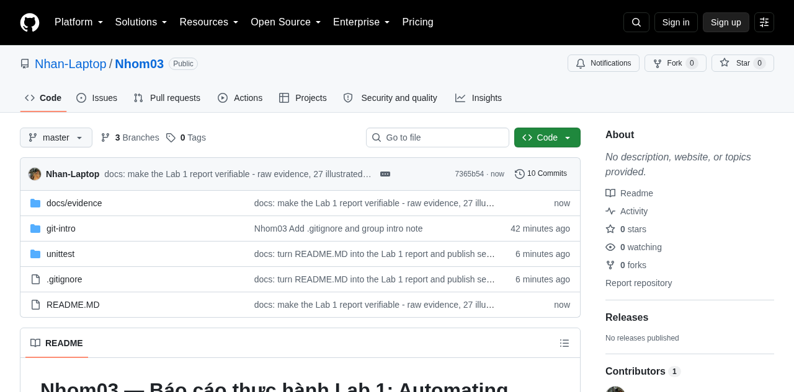

### 7.2 Danh sách commit — đối chiếu với bảng ở mục 1.7 và 6.3

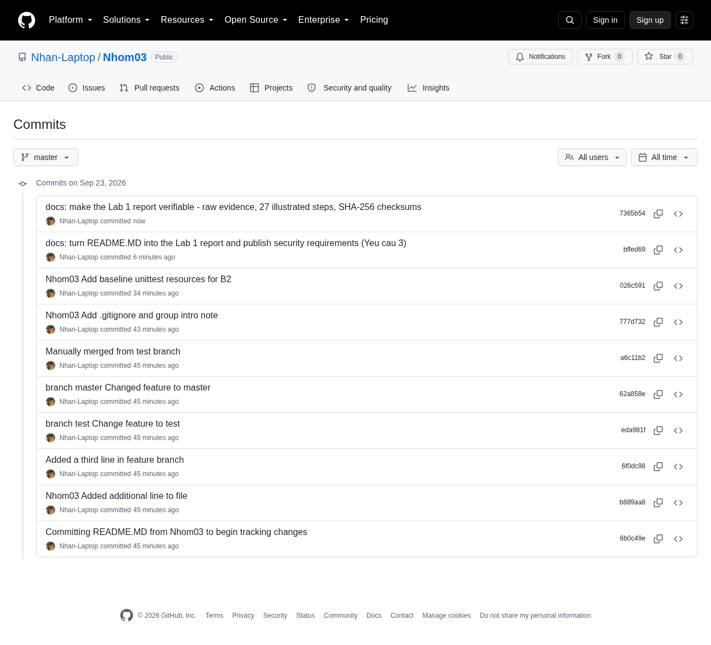

### 7.3 Danh sách nhánh — `master`, `manual`, `agent`

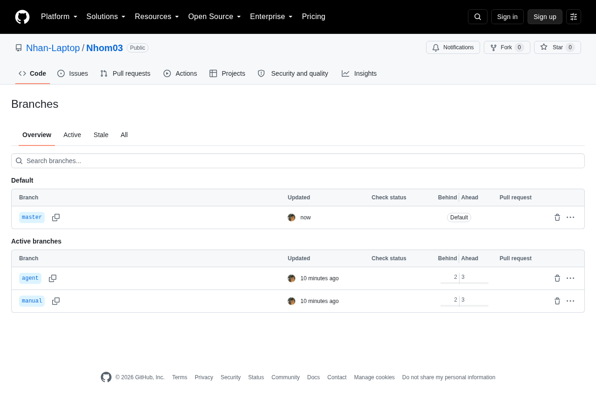

> Nhánh `test` của B.1.5 được giữ **cục bộ** (không push) vì B.1.6 chỉ yêu cầu gửi branch `master`;
> sự tồn tại và lịch sử của nó vẫn được chứng minh đầy đủ trong `docs/evidence/LAB1-B1-evidence.md` (Hình 9–12).
